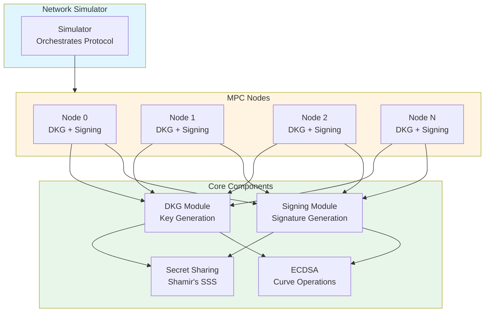
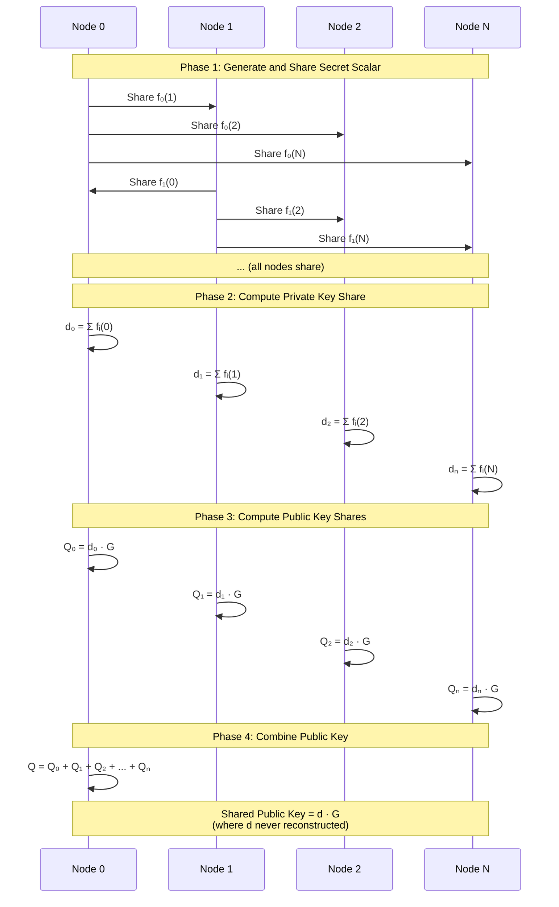
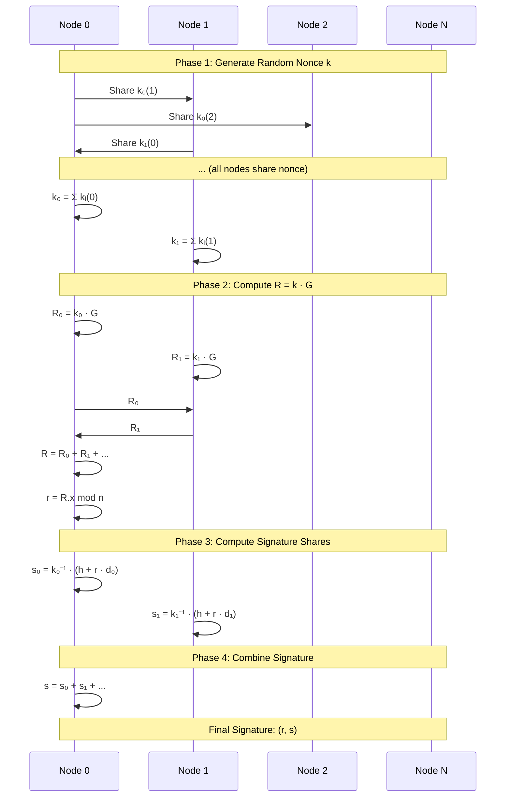

# Threshold ECDSA Multi-Party Computation Demo

A demonstration of threshold ECDSA signature generation using Multi-Party Computation (MPC) in Go. Multiple parties collaboratively generate an ECDSA key pair and sign messages without ever reconstructing the private key.

## Overview

This project implements **threshold ECDSA signatures** where:

- **n parties** collaborate to generate a shared ECDSA key pair
- **t+1 parties** (threshold) must cooperate to create a signature
- The **private key is never reconstructed** - it only exists as shares
- Individual parties cannot sign alone or learn the private key

The implementation includes:

- **Shamir's Secret Sharing** for distributing secrets
- **Distributed Key Generation (DKG)** for collaborative key generation
- **Threshold Signing Protocol** for distributed signature creation
- **Network Simulator** for multi-party communication

## Architecture



### Core Components

1. **Secret Sharing** (`internal/secretsharing/`)

   - Shamir's Secret Sharing over finite fields
   - Supports threshold-based reconstruction (k-out-of-n)
   - Polynomial-based secret distribution

2. **ECDSA Operations** (`internal/ecdsa/`)

   - Elliptic curve point arithmetic
   - Point addition and scalar multiplication
   - Signature generation and verification

3. **Distributed Key Generation** (`internal/dkg/`)

   - Collaborative key pair generation
   - Private key shares computation
   - Public key aggregation

4. **Threshold Signing** (`internal/signing/`)

   - Distributed nonce generation
   - Signature share computation
   - Share combination into final signature

5. **Network Simulator** (`cmd/mpc-demo/network/`)
   - Simulates P2P communication
   - Message routing between nodes
   - Protocol orchestration

## How It Works

### Distributed Key Generation (DKG)



**Important Security Note**: The actual secret scalars (`a_i`) are **never transmitted**. Only polynomial evaluations (shares) are shared. A single share reveals nothing about the secret - you need threshold+1 shares to reconstruct.

### Threshold Signing Protocol



## Running the Demo

### Prerequisites

- Go 1.19 or later

### Installation

```bash
# Clone the repository
git clone <repository-url>
cd mpc-demo

# Install dependencies
go mod tidy
```

### Execute

```bash
go run cmd/mpc-demo/main.go
```

### Example Output

```
=== Threshold ECDSA Signature Demo ===
Configuration:
  Number of parties: 5
  Threshold: 3

Phase 1: Distributed Key Generation (DKG)
✅ Shared public key generated: (x: ..., y: ...)

Phase 2: Threshold Signing
Message to sign: Hello, Threshold ECDSA!
✅ Signature generated: (r: ..., s: ...)

Phase 3: Signature Verification
✅ Signature is VALID!

Key achievements:
  • Shared key pair generated without reconstructing private key
  • Signature generated without reconstructing private key
  • Private key never existed in one place
  • Signature verified successfully with shared public key
```

## Security Properties

1. **Privacy**: Private key is never reconstructed - only shares exist
2. **Threshold Security**: Requires t+1 parties to sign (resistant to up to t malicious parties)
3. **Correctness**: All honest parties compute the same public key and signature
4. **Additive Homomorphism**: Public key aggregation works without private key reconstruction

## Implementation Details

### Secret Sharing

Each node generates a random secret scalar `s_i` and creates a polynomial:

```
f_i(x) = s_i + a₁x + a₂x² + ... + aₜxᵗ
```

Shares are polynomial evaluations: `f_i(0), f_i(1), ..., f_i(n)`

### DKG Protocol

1. Each node generates random scalar `s_i` and shares it
2. Nodes compute local private key share: `d_i = Σⱼ f_j(i)`
3. Shared private key: `d = Σᵢ s_i` (never reconstructed)
4. Public key: `Q = d · G = (Σᵢ d_i) · G = Σᵢ (d_i · G)`

### Threshold Signing

1. **Nonce Generation**: Joint generation of random `k` via secret sharing
2. **Compute R**: `R = k · G`, extract `r = R.x mod n`
3. **Signature Shares**: Each node computes `s_i = k_i⁻¹ · (h + r · d_i)`
4. **Combine**: Final signature `s = Σᵢ s_i`

## Limitations

This is a **toy/educational implementation** with the following limitations:

- **Honest-but-curious security model** (no malicious security proofs)
- **Simplified nonce generation** (nonces are reconstructed for simplicity)
- **No zero-knowledge proofs** (would be needed for production)
- **Simulated network** (uses channels, not real network)

## Educational Notes

This implementation demonstrates:

- How secret sharing enables threshold cryptography
- Distributed key generation without a trusted dealer
- Threshold signature generation without key reconstruction
- Additive homomorphic properties of elliptic curves

## License

Educational project - feel free to use and modify for learning purposes.
